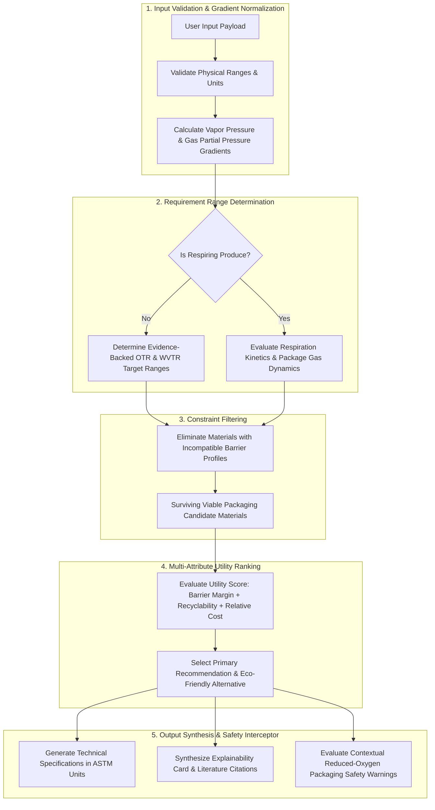

# Recommendation Engine Specification: Domain-Guided Decision Support

**Document Type:** Algorithmic & Decision-Support Specification  
**Problem Statement ID:** SIH26236  
**Primary Source:** [docs/Problem_Statement.md](file:///d:/Food-Packaging-AI/docs/Problem_Statement.md)  
**Product Requirements:** [docs/PRD.md](file:///d:/Food-Packaging-AI/docs/PRD.md)  
**Scientific Foundation:** [docs/Research_and_Evidence.md](file:///d:/Food-Packaging-AI/docs/Research_and_Evidence.md)  
**Data Model:** [docs/Data_Model.md](file:///d:/Food-Packaging-AI/docs/Data_Model.md)  

---

## 1. Algorithmic Approach Evaluation & Separation of Concerns

The recommendation engine is an **evidence-backed, explainable decision-support system**. It does not employ black-box machine learning models for the MVP because validated empirical shelf-life training datasets do not exist in packaging literature for open-ended generalization.

### 1.1 Four Distinct Layers of the Recommendation Logic
To ensure transparency and prevent pseudo-scientific claims, the engine strictly separates its logic into four tiers:
1. **Evidence-Backed Scientific Constraints:** Non-negotiable physical and biological rules derived directly from peer-reviewed postharvest literature, official food safety regulations, and ASTM testing standards (e.g. microbial $a_w$ cutoffs, documented crop-specific $\text{O}_2/\text{CO}_2$ injury limits).
2. **Deterministic Engineering Calculations:** Transparent physical relationships governing gas transmission and kinetics (e.g. vapor pressure gradient $\Delta p_w$, Arrhenius temperature adjustments, produce respiration $Q_{10}$ scaling).
3. **Explicit Prototype Assumptions `[PROTOTYPE ASSUMPTION]`:** Pragmatic engineering baselines adopted for the hackathon prototype (e.g. standard pouch surface-area-to-volume ratio, indicative critical moisture gain tolerance $\Delta M_{crit}$, normalized relative cost indices).
4. **Multi-Attribute Ranking Preferences:** A configurable Multi-Criteria Decision Analysis (MCDA) utility function that balances barrier safety margin, recyclability/sustainability, and relative cost according to user preference.

### 1.2 Algorithmic Comparison & Justification

| Approach | Scientific Grounding | Data Requirements | Explainability in ASTM Units | Safety & Determinism | Prototype Decision |
| :--- | :--- | :--- | :--- | :--- | :--- |
| **Deep Learning / Neural Networks** | Poor (treats permeation physics as black box; prone to hallucinations) | Requires thousands of empirical shelf-life packaging test records (unavailable) | Uninterpretable (cannot explain why in ASTM terms) | High risk of dangerous hallucinations in food safety | **REJECTED** |
| **Supervised Machine Learning** | Moderate (predicts material category from historical labels) | Substantial labeled tabular dataset of commodity-material pairs | Moderate (feature importance only; cannot output continuous ranges) | Risk of predicting inappropriate materials on unseen combinations | **DEFERRED (Future Scope)** |
| **Domain-Guided Constraint Satisfaction + Multi-Attribute Ranking (MCDA)** | **High** (grounded in mass transfer laws, Arrhenius kinetics, and ASTM standards) | Curated, verifiable physical properties and literature benchmarks | **Complete** (deterministic traces: "disqualified because WVTR exceeds requirement range") | **High** (enforces hard physical boundaries and contextual safety warnings) | **SELECTED FOR MVP** |

---

## 2. Complete Recommendation Pipeline

---

## 3. Mathematical & Logical Formulation

### 3.1 Water Vapor Transmission Rate (WVTR) Requirement Range
Water vapor transfer is driven by the water vapor partial pressure differential across the packaging boundary:
$$\Delta p_w = p_{sat}(T) \cdot \left(\frac{\text{RH}_{ext}}{100} - a_w\right)$$
Where $p_{sat}(T)$ is saturated vapor pressure in kPa (Tetens/Antoine approximation):
$$p_{sat}(T) = 0.61078 \exp\left(\frac{17.27 \cdot T}{T + 237.3}\right)$$

#### Prototype Engineering Estimation (Target Range)
For dry, moisture-sensitive goods ($a_w < 0.40$), the engine does not claim to compute a laboratory-validated "exact cutoff". Instead, it derives a **conditional target requirement range** based on a steady-state mass transfer approximation:
$$\text{WVTR}_{target} \approx \frac{\Delta M_{crit} \cdot W_{food}}{A_{pack} \cdot t_{shelf}} \cdot \left(\frac{p_{sat}(37.8) \cdot 0.90}{\Delta p_w}\right)$$

- **Explicit Assumptions & Boundaries:**
  - $\Delta M_{crit}$: Estimated permissible moisture gain before critical texture loss (default baseline: $1.5\% - 3.0\%$ dry basis) `[PROTOTYPE ASSUMPTION]`.
  - $W_{food} / A_{pack}$: Nominal pouch packaging geometry (default baseline: $0.05 - 0.10\ \text{m}^2\text{ per }100\text{ g}$) `[PROTOTYPE ASSUMPTION]`.
  - *Applicability:* Valid strictly for steady-state isothermal storage without film defect pinholes.
- **Categorical Target Ranges:**
  - *Severe Moisture Sensitivity ($a_w < 0.30$, crispy fried snacks, dry infant milk powder):* Supported requirement range $\text{WVTR} < 0.5 - 1.5\ \text{g}/(\text{m}^2 \cdot \text{day})$.
  - *Moderate Moisture Sensitivity ($a_w 0.30 - 0.50$, biscuits, dry pasta):* Supported requirement range $\text{WVTR} < 2.0 - 5.0\ \text{g}/(\text{m}^2 \cdot \text{day})$.
  - *Low Sensitivity ($a_w > 0.60$ non-crispy):* WVTR governed by desiccation prevention rather than staling.

### 3.2 Oxygen Transmission Rate (OTR) Requirement Range
Oxygen barrier demands are mapped from unsaturated lipid fraction, light sensitivity, and shelf-life duration:
- **High Oxidation Risk (Fat $> 20\%$, shelf life $\ge 90$ days, e.g. potato crisps, nuts):** Supported requirement range $\text{OTR} \le 1.0 - 2.5\ \text{cm}^3 / (\text{m}^2 \cdot \text{day} \cdot \text{atm})$ at $23^\circ\text{C}$ (**ASTM D3985**). Mandates opaque or metallized substrate to prevent photo-oxidation.
- **Moderate Oxidation Risk (Fat $5\% - 20\%$, shelf life $\ge 60$ days):** Supported requirement range $\text{OTR} \le 15.0 - 40.0\ \text{cm}^3 / (\text{m}^2 \cdot \text{day} \cdot \text{atm})$.
- **Low Risk (Fat $< 5\%$):** OTR unconstrained by lipid rancidity; governed by aerobic microbial mold suppression ($\text{OTR} \le 100.0 - 150.0$).

### 3.3 Fresh Produce Respiration & MAP Evaluation
Fresh produce packaging **must not** apply blanket rules (e.g. "barrier films are always disqualified for respiring produce"). Instead, packaging suitability depends on the coupled interaction of:
1. Crop respiration rate $R(T)$ and respiratory quotient $RQ = R_{\text{CO}_2}/R_{\text{O}_2}$.
2. Product weight ($W$) and free package volume ($V$).
3. Packaging surface area ($A$) and film transmission rates ($\text{OTR}, \text{CTR}$).
4. Storage temperature ($T$) and $Q_{10}$ scaling:
   $$R(T) = R(T_{ref}) \cdot Q_{10}^{\frac{T - T_{ref}}{10}}$$
5. Target equilibrium atmosphere ($\% \text{O}_2, \% \text{CO}_2$).
6. Cultivar-specific lower $\text{O}_2$ fermentation extinction limit and upper $\text{CO}_2$ injury tolerance limit.

#### Produce Decision Logic:
- **Equilibrium Mass Transfer Check:** At steady-state, required transmission is:
  $$\text{OTR}_{req} = \frac{R_{\text{O}_2} \cdot W}{A \cdot (0.21 - p_{\text{O}_2}^{pkg})}$$
- **Micro-perforation vs Continuous Film:** 
  - Standard continuous polymer films exhibit a permselectivity ratio $\beta = \text{CTR}/\text{OTR} \approx 3.0 - 6.0$, which is higher than typical produce $RQ \approx 0.8 - 1.3$.
  - When continuous film permeation cannot maintain internal $\text{O}_2 \ge \text{critical extinction limit}$ without causing injurious $\text{CO}_2$ accumulation for high-respiration produce (e.g. broccoli, mushrooms, asparagus), the engine evaluates **micro-perforated films** (pore diffusion ratio $\approx 0.81$) or **breathable membranes**.
  - For low-respiration commodities (e.g. apples, dates) under specific packaging geometries, continuous permeable films (e.g. LDPE) may be suitable.
- **Data Gap Handling:** If documented gas tolerance limits for a crop are absent from published postharvest compendiums, the engine returns **`[RESEARCH REQUIRED]`** rather than inventing a gas mixture.

### 3.4 Nominal Film Thickness Determination
Nominal gauge is estimated as a conditional engineering recommendation:
$$\text{Thickness}_{\text{recommended}} = \max\left(l_{\text{barrier}}, l_{\text{transit}}\right)$$
- $l_{\text{barrier}}$: Calculated nominal thickness required for the selected polymer resin to achieve the target WVTR/OTR range under Fick's first law.
- $l_{\text{transit}}$: Structural handling baseline `[PROTOTYPE ASSUMPTION]`:
  - *Local Standard:* $25 - 35\ \mu\text{m}$.
  - *Long-Haul Refrigerated:* $40 - 50\ \mu\text{m}$.
  - *Rough Terrain / Unpaved:* $60 - 75\ \mu\text{m}$ (or reinforced laminate web).

### 3.5 Multi-Attribute Candidate Ranking & Trade-Off Analysis (Decision-Support Preference)
Surviving candidate materials $m \in M_{\text{viable}}$ that satisfy all physical barrier and safety constraints are ranked using a multi-attribute utility function:
$$U(m) = w_b \cdot S_{\text{barrier}}(m) + w_s \cdot S_{\text{sustainability}}(m) + w_c \cdot S_{\text{cost}}(m)$$

#### Documented Decision-Support Preference Presets `[PROTOTYPE ASSUMPTION]`:
1. **Balanced Preset (Default):**
   - $w_b = 0.50$ (50% Barrier Margin)
   - $w_s = 0.30$ (30% Circularity & Sustainability)
   - $w_c = 0.20$ (20% Economic Cost Index)
2. **Sustainability-Focused Preset:**
   - $w_b = 0.40$ (40% Barrier Margin)
   - $w_s = 0.45$ (45% Circularity & Sustainability)
   - $w_c = 0.15$ (15% Economic Cost Index)
3. **Cost-Sensitive Preset:**
   - $w_b = 0.40$ (40% Barrier Margin)
   - $w_s = 0.15$ (15% Circularity & Sustainability)
   - $w_c = 0.45$ (45% Economic Cost Index)

> [!IMPORTANT]
> **PROTOTYPE ASSUMPTION NOTICE:** Weight presets provide decision-support trade-off sensitivity modeling, not scientifically optimal constants or certified procurement advice.

#### Hard Constraints vs. Soft Preferences:
- **Hard Constraints (Filtering Gate):** Determine candidate *qualification*. Materials must strictly satisfy moisture barrier (ASTM F1249), oxygen barrier (ASTM D3985), mechanical transport stress, and respiring produce breathability / micro-perforation criteria.
- **Soft Preferences (Ranking Utility):** Determine relative *order* among qualified materials. A candidate failing hard barrier constraints is strictly rejected and **cannot become acceptable** regardless of circularity or low cost.

#### Component Metric Scoring:
- **Barrier Safety Score ($S_{\text{barrier}}$):** Base score 0.85 for meeting threshold, +0.08 if nominal WVTR $\le 50\%$ target, +0.07 if nominal OTR $\le 50\%$ target; -0.20 penalty if conditionally eligible.
- **Sustainability Score ($S_{\text{sustainability}}$):** Mono-material mechanical recycling ($1.0$), certified compostable bio-film ($0.85$), coextrusion/monolayer ($0.65$), metallized film ($0.50$), unrecyclable multi-material laminate ($0.20$).
- **Cost Score ($S_{\text{cost}}$):** Inverse relative cost index ($1.0 / \text{relative\_cost\_multiplier}$, where LDPE = 1.0).

#### Transparent Score Breakdown:
For each ranked candidate, the engine exposes factor score contributions:
$$\text{Contribution}_{\text{barrier}} = w_b \cdot S_{\text{barrier}}$$
$$\text{Contribution}_{\text{sust}} = w_s \cdot S_{\text{sust}}$$
$$\text{Contribution}_{\text{cost}} = w_c \cdot S_{\text{cost}}$$
$$U(m) = \text{Contribution}_{\text{barrier}} + \text{Contribution}_{\text{sust}} + \text{Contribution}_{\text{cost}}$$

---

## 4. Explainability & Disqualification Tracing

The system synthesizes human-readable traces explaining *why* candidates succeeded or failed:
- **Primary Spoilage Driver:** Cites the dominant physical/chemical attribute (e.g. *"Moisture sensitivity ($a_w < 0.30$) requires strict water vapor barrier to prevent texture degradation"*).
- **Disqualification Reason:** Explicitly cites the barrier failure (e.g. *"LDPE was rejected because its nominal WVTR ($15\ \text{g}$) exceeds the supported requirement range ($< 1.5\ \text{g}$), risking premature sogginess"*).
- **Evidence Trace:** Links recommendation attributes directly to `reference_id` bibliographic entries.

---

## 5. Contextual Food Safety & Reduced-Oxygen Packaging Advisory

The system **does not** act as a simplistic binary classifier declaring food "safe" or "unsafe" based on pH and temperature alone. Food safety in commercial packaging involves complex multi-hurdle interactions ($a_w$, pH, preservatives, thermal lethality, packaging atmosphere, hygiene).

### 5.1 Conservative Safety Advisory Interceptor
When a user evaluates a commodity with:
- High moisture ($a_w > 0.92$ or moisture $> 60\%$), AND
- Low acidity ($pH \ge 4.6$), AND
- Hermetic packaging format under reduced oxygen ($\text{O}_2 < 2.0\%$ or vacuum):

The engine attaches a prominent **Food Safety Advisory**:
> **REDUCED-OXYGEN PACKAGING (ROP) SAFETY ADVISORY:**  
> Low-acid, high-moisture foods packaged under anaerobic or reduced-oxygen conditions present a recognized risk of *Clostridium botulinum* growth and toxin formation without overt sensory spoilage.  
> - Recommendations produced by this system represent preliminary physical barrier guidance only and **are not certified for commercial food safety**.  
> - Commercial implementation of reduced-oxygen packaging for low-acid foods mandates validated multi-hurdle controls (e.g., commercial retort sterilization, water activity hurdles, acidification, or continuous strict refrigeration below $3.0^\circ\text{C}$) in compliance with regional regulations (FDA 21 CFR 114 / FSSAI Packaging Regulations). Professional food technology verification is required.
