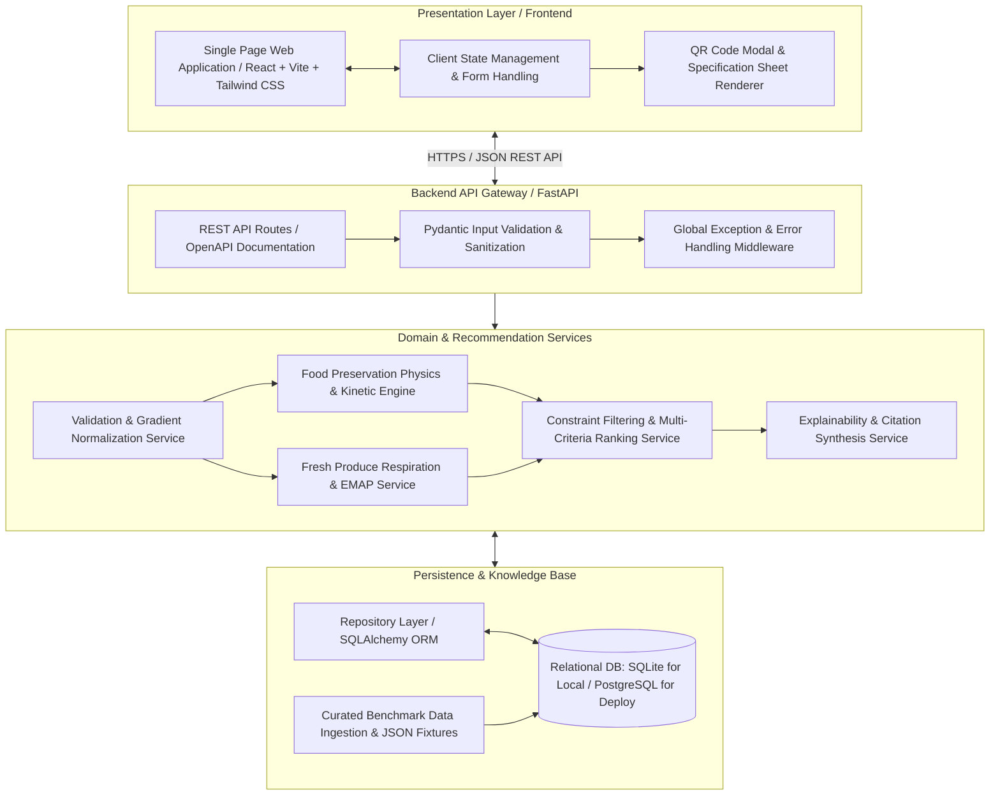

# System Architecture: AI-Based Food Packaging Recommendation System

**Document Type:** Technical Implementation Architecture  
**Problem Statement ID:** SIH26236  
**Primary Source:** [docs/Problem_Statement.md](file:///d:/Food-Packaging-AI/docs/Problem_Statement.md)  
**Product Requirements:** [docs/PRD.md](file:///d:/Food-Packaging-AI/docs/PRD.md)  
**System Design:** [docs/System_Design.md](file:///d:/Food-Packaging-AI/docs/System_Design.md)  
**Intelligence Spec:** [docs/AI_Recommendation_Engine.md](file:///d:/Food-Packaging-AI/docs/AI_Recommendation_Engine.md)  

---

## 1. Architectural Philosophy: The Modular Monolith

Per the engineering principles in [docs/SaaS_Playbook_Reference.md](file:///d:/Food-Packaging-AI/docs/SaaS_Playbook_Reference.md), early projects and hackathon prototypes must avoid premature distributed complexity (no microservices, no Kafka, no Kubernetes). 

The system is architected as a **Modular Monolith**:
- Low operational burden for a small development team.
- High developer velocity and single-command local setup.
- Strict internal separation of concerns: domain calculations, recommendation logic, API controllers, and presentation layers remain decoupled.

---

## 2. Component Architecture Diagram



---

## 3. Technology Stack & Trade-Off Analysis

| Layer | Chosen Technology | Justification | Alternatives Considered & Rejected |
| :--- | :--- | :--- | :--- |
| **Backend Framework** | **Python (FastAPI)** | Explicitly cited in SIH26236 statement. Native Pydantic data validation, high performance, automatic OpenAPI documentation, and seamless integration with scientific food physics libraries. | **Node.js / Express:** Rejected due to weaker ecosystem for numerical food physics and postharvest modeling. **Django:** Rejected as excessively heavyweight with unwanted admin overhead. |
| **Frontend Framework** | **React / Vite + TypeScript + Tailwind CSS** | Fast developer feedback loop, type safety, responsive utility styling for mobile/desktop, rich component ecosystem for sliders and cards. | **Flutter Web:** Cited in SIH as an option, but web deployment of Flutter has higher payload overhead and poorer accessibility compared to modern React. |
| **Database & ORM** | **SQLite (Dev) / PostgreSQL (Prod) via SQLAlchemy** | Zero-configuration local database for testing and demonstration; effortless migration to hosted PostgreSQL (Render/Neon) for live deployment. | **MongoDB / NoSQL:** Rejected because the domain model is highly relational with foreign-key links between commodities, barrier properties, and bibliographic evidence. |
| **Validation Layer** | **Pydantic v2** | Enforces strict type boundaries, physical clamping ($0 \le \text{moisture} \le 100$), and consistent error responses at the HTTP boundary. | Manual schema validation: Rejected as brittle and prone to unhandled exceptions. |
| **Testing Framework** | **Pytest (Backend) + Vitest / Playwright (Frontend)** | Standard, battle-tested Python and TypeScript test runners supporting fast unit and integration tests. | Custom test runners: Rejected. |

---

## 4. Repository Folder Structure

```
d:/Food-Packaging-AI/
├── CLAUDE.md                     # Agent memory and core rules
├── README.md                     # Project overview and run guides
├── docs/                         # Complete documentation foundation
│   ├── Problem_Statement.md
│   ├── Research_and_Evidence.md
│   ├── PRD.md
│   ├── System_Design.md
│   ├── Architecture.md
│   ├── Data_Model.md
│   ├── AI_Recommendation_Engine.md
│   ├── Design.md
│   ├── Rules.md
│   ├── Phases.md
│   ├── Testing_Security.md
│   ├── Evaluation.md
│   └── Memory.md
├── backend/                      # Python FastAPI application
│   ├── app/
│   │   ├── api/                  # API endpoints and route handlers
│   │   ├── core/                 # Config, logging, security settings
│   │   ├── domain/               # Pure food physics and preservation formulas
│   │   ├── models/               # SQLAlchemy ORM database models
│   │   ├── schemas/              # Pydantic request/response schemas
│   │   ├── services/             # Recommendation, EMAP, and explainability services
│   │   └── repositories/         # Database access and query abstractions
│   ├── tests/                    # Unit, integration, and rule validation tests
│   └── requirements.txt          # Python dependencies
├── frontend/                     # React + Vite web application
│   ├── src/
│   │   ├── assets/               # Static icons, diagrams
│   │   ├── components/           # UI components (Inputs, Results, Cards, QR)
│   │   ├── hooks/                # Data fetching and form hooks
│   │   ├── pages/                # Main recommendation and benchmark views
│   │   ├── services/             # Backend API client
│   │   └── types/                # TypeScript interface definitions
│   └── package.json              # Node dependencies
├── data/                         # Curated datasets and knowledge base
│   ├── raw/                      # Sourced USDA / FAO / ASTM reference tables
│   ├── processed/                # Normalized JSON fixtures
│   └── knowledge_base/           # Seed scripts for database initialization
└── reference/                    # Reference documents and playbooks
```

---

## 5. Security & Boundary Architecture

1. **Server as Single Source of Truth:**
   - No barrier calculations, candidate filtering, or safety checks occur solely on the client.
   - All physical validations, requirement evaluations, and contextual food safety advisories are executed server-side in `backend/app/domain/`.
2. **Input Sanitization & Injection Prevention:**
   - All REST parameters are typed, bounded, and sanitized via Pydantic schemas.
   - Database operations use parameterized queries through SQLAlchemy, eliminating SQL injection.
3. **Environment Security:**
   - No hardcoded secrets or environment variables. All configurations load from `.env` with a documented `.env.example`.
4. **CORS & Error Hardening:**
   - Strict CORS policy restricting requests to the designated frontend origin.
   - Global exception handler intercepts unhandled server errors, returning clean JSON payloads and redacting internal stack traces.

---

## 6. Major Technical Risks & Mitigations

| Technical Risk | Impact | Architectural Mitigation |
| :--- | :--- | :--- |
| **Respiration & Temperature Discrepancy:** Temperature abuse during transit drastically increases produce respiration. | Critical (spoilage / off-odors) | System incorporates $Q_{10}$ scaling algorithms and warns against non-perforated packaging for high-respiration crops. |
| **Data Incompleteness for Niche Crops:** User inputs a regional crop lacking published postharvest data. | High (unsupported state) | Clean fallback to `[RESEARCH REQUIRED]` state; prompts user for custom physical properties rather than guessing. |
| **Multi-Criteria Weight Sensitivity:** Users disagree on the relative balance between cost and sustainability. | Moderate (dissatisfaction) | The UI exposes interactive weighting toggles (e.g., "Prioritize Eco-Friendly" vs "Prioritize Lowest Cost"), recalculating utility transparently. |
| **Deployment Complexity:** Hackathon internet instability or server container crash. | High (demo failure) | Fully standalone local execution capability using lightweight SQLite and pre-bundled frontend assets. |
