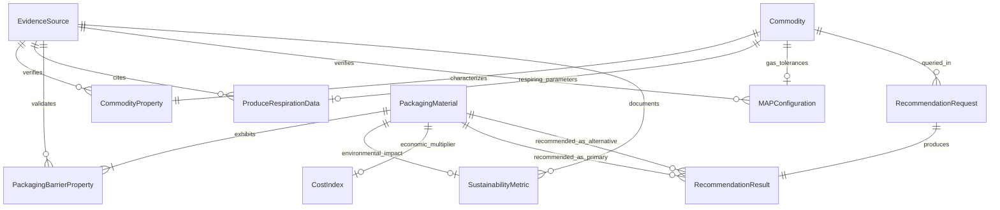

# Logical Data Model: AI-Based Food Packaging Recommendation System

**Document Type:** Logical Data Model  
**Problem Statement ID:** SIH26236  
**Primary Source:** [docs/Problem_Statement.md](file:///d:/Food-Packaging-AI/docs/Problem_Statement.md)  
**Product Requirements:** [docs/PRD.md](file:///d:/Food-Packaging-AI/docs/PRD.md)  
**Scientific Evidence:** [docs/Research_and_Evidence.md](file:///d:/Food-Packaging-AI/docs/Research_and_Evidence.md)  
**System Design:** [docs/System_Design.md](file:///d:/Food-Packaging-AI/docs/System_Design.md)  

---

## 1. Entity-Relationship Overview

The logical data model establishes a normalized, citation-linked schema supporting food preservation physics, polymer barrier properties, and transparent explainability.

---

## 2. Entity Specifications

### 2.1 EvidenceSource
- **Purpose:** Central bibliographic catalog ensuring every scientific claim, barrier rate, and threshold is auditable and cited.
- **Attributes:**
  - `reference_id` (PK, string, unique, e.g. `REF_ROBERTSON_2012`)
  - `citation_short` (string, e.g. `Robertson 2012`)
  - `title` (string, e.g. `Food Packaging: Principles and Practice, 3rd Ed.`)
  - `authors` (string)
  - `publication_year` (integer, e.g. `2012`)
  - `source_type` (enum: `textbook`, `peer_reviewed_journal`, `standards_document`, `government_compendium`, `manufacturer_tds`)
  - `doi_or_standard_number` (string, nullable, e.g. `ASTM D3985`)
  - `notes` (text, nullable)
- **Validation:** `citation_short` and `title` are required.

---

### 2.2 Commodity
- **Purpose:** Core entity representing a food item or agricultural commodity.
- **Attributes:**
  - `commodity_id` (PK, string, unique, e.g. `COMM_POTATO_CHIPS`, `COMM_BROCCOLI`)
  - `common_name` (string, e.g. `Potato Chips`)
  - `scientific_name` (string, nullable, e.g. `Brassica oleracea var. italica`)
  - `category` (enum: `fruit`, `vegetable`, `grain_cereal`, `bakery`, `snack_fried`, `dairy_powder`, `meat_poultry`, `seafood`, `spices_condiments`)
  - `is_respiring` (boolean, required: `true` for fresh produce, `false` for processed goods)
  - `default_storage_mode` (enum: `ambient`, `chilled`, `frozen`)
  - `description` (text, nullable)
- **Relationships:** One-to-One with `CommodityProperty`; One-to-Optional with `ProduceRespirationData` and `MAPConfiguration`.

---

### 2.3 CommodityProperty
- **Purpose:** Quantitative and categorical physical, chemical, and biological degradation sensitivities of a commodity.
- **Attributes:**
  - `property_id` (PK, string, unique)
  - `commodity_id` (FK, references `Commodity.commodity_id`, required, unique)
  - `typical_moisture_pct` (float, unit: `%`, range: `0.0` to `100.0`, required)
  - `critical_water_activity_aw` (float, unit: dimensionless, range: `0.00` to `1.00`, required)
  - `oil_fat_content_pct` (float, unit: `%`, range: `0.0` to `100.0`, required)
  - `typical_ph` (float, unit: dimensionless, range: `1.0` to `14.0`, required)
  - `primary_spoilage_pathways` (JSON array of strings: `moisture_gain`, `moisture_loss`, `oxidation`, `microbial_pathogen`, `mold_yeast`, `senescence_fermentation`)
  - `is_light_sensitive` (boolean, required, triggers opaque/metallized substrate need)
  - `recommended_temp_min_c` (float, unit: `°C`, required)
  - `recommended_temp_max_c` (float, unit: `°C`, required)
  - `recommended_rh_min_pct` (float, unit: `%`, range: `0.0` to `100.0`, required)
  - `recommended_rh_max_pct` (float, unit: `%`, range: `0.0` to `100.0`, required)
  - `reference_id` (FK, references `EvidenceSource.reference_id`, required)
- **Validation:** `recommended_temp_min_c` $\le$ `recommended_temp_max_c`.

---

### 2.4 ProduceRespirationData
- **Purpose:** Post-harvest biological respiration and gas exchange parameters for fresh produce.
- **Attributes:**
  - `respiration_id` (PK, string, unique)
  - `commodity_id` (FK, references `Commodity.commodity_id`, required)
  - `reference_temp_c` (float, unit: `°C`, e.g. `5.0` or `20.0`, required)
  - `respiration_rate_co2` (float, unit: $\text{mg CO}_2 \cdot \text{kg}^{-1} \cdot \text{h}^{-1}$, range: $\ge 0.0$, required)
  - `respiration_class` (enum: `very_low`, `low`, `moderate`, `high`, `very_high`, `extremely_high`, required)
  - `q10_factor` (float, unit: dimensionless, typical range: `1.8` to `3.0`, required)
  - `critical_o2_extinction_pct` (float, unit: `%`, range: `0.5` to `5.0`, required)
  - `max_tolerable_co2_pct` (float, unit: `%`, range: `1.0` to `25.0`, required)
  - `condensation_risk_level` (enum: `low`, `medium`, `high`, required)
  - `reference_id` (FK, references `EvidenceSource.reference_id`, required)
- **Validation:** Only valid for commodities where `is_respiring = true`.

---

### 2.5 PackagingMaterial
- **Purpose:** Catalog of base polymers, substrates, and commercial laminates explicitly cited in SIH Problem Statement SIH26236.
- **Attributes:**
  - `material_id` (PK, string, unique, e.g. `MAT_MET_PET_PE`, `MAT_LDPE_MONO`, `MAT_PLA_BIO`)
  - `name` (string, e.g. `Metallized BoPET / Polyethylene Laminate`)
  - `trade_code` (string, e.g. `MET-PET/PE`, `LDPE`, `HDPE`, `BoPET`, `PLA`)
  - `material_family` (enum: `LDPE`, `HDPE`, `PET`, `metallized_film`, `aluminum_foil_laminate`, `biodegradable_film`, `breathable_film`)
  - `structure_type` (enum: `monolayer`, `coextrusion`, `multi_layer_laminate`, `perforated_film`, `microporous_membrane`)
  - `density_g_cm3` (float, unit: $\text{g/cm}^3$, range: `0.85` to `2.70`, required)
  - `is_biodegradable` (boolean, required)
  - `recyclability_category` (enum: `mono_material_recyclable`, `specialized_recycling`, `industrial_compostable`, `non_recyclable_landfill`)
  - `food_contact_compliant` (boolean, required: certifies baseline regulatory suitability)
  - `sealability_rating` (enum: `excellent`, `good`, `moderate`, `poor`, `non_sealable`, required)
  - `seal_initiation_temp_c` (float, unit: `°C`, nullable)
  - `reference_id` (FK, references `EvidenceSource.reference_id`, required)
- **Relationships:** One-to-Many with `PackagingBarrierProperty`.

---

### 2.6 PackagingBarrierProperty
- **Purpose:** Standardized barrier, transmission, and mechanical specifications for a given material structure at a defined nominal thickness.
- **Attributes:**
  - `barrier_id` (PK, string, unique)
  - `material_id` (FK, references `PackagingMaterial.material_id`, required)
  - `nominal_thickness_um` (float, unit: $\mu\text{m}$, range: `5.0` to `250.0`, required)
  - `nominal_thickness_mil` (float, unit: $\text{mil}$, derived: `thickness_um / 25.4`)
  - `otr_value` (float, unit: $\text{cm}^3 / (\text{m}^2 \cdot \text{day} \cdot \text{atm})$, required)
  - `otr_test_temp_c` (float, unit: `°C`, default: `23.0`, required)
  - `otr_test_rh_pct` (float, unit: `%`, default: `0.0`, required)
  - `wvtr_value` (float, unit: $\text{g} / (\text{m}^2 \cdot \text{day})$, required)
  - `wvtr_test_temp_c` (float, unit: `°C`, default: `37.8`, required)
  - `wvtr_test_rh_pct` (float, unit: `%`, default: `90.0`, required)
  - `co2_tr_value` (float, unit: $\text{cm}^3 / (\text{m}^2 \cdot \text{day} \cdot \text{atm})$, nullable)
  - `tensile_strength_md_mpa` (float, unit: $\text{MPa}$, range: $\ge 0.0$, required)
  - `elongation_at_break_pct` (float, unit: `%`, range: $\ge 0.0$, required)
  - `puncture_resistance_n` (float, unit: $\text{N}$, range: $\ge 0.0$, required)
  - `is_breathable` (boolean, required)
  - `is_microperforated` (boolean, required)
  - `microperforation_density_per_m2` (integer, nullable)
  - `test_standard_otr` (string, default: `ASTM D3985`, required)
  - `test_standard_wvtr` (string, default: `ASTM F1249`, required)
  - `reference_id` (FK, references `EvidenceSource.reference_id`, required)
- **Validation:** `nominal_thickness_um` $> 0.0$; all transmission rates $\ge 0.0$.

---

### 2.7 MAPConfiguration
- **Purpose:** Evidence-backed Modified Atmosphere Packaging gas targets for specific food commodities documented in peer-reviewed postharvest literature.
- **Attributes:**
  - `map_id` (PK, string, unique)
  - `commodity_id` (FK, references `Commodity.commodity_id`, required, unique)
  - `recommended_o2_min_pct` (float, unit: `%`, range: `0.0` to `21.0`, required)
  - `recommended_o2_max_pct` (float, unit: `%`, range: `0.0` to `21.0`, required)
  - `recommended_co2_min_pct` (float, unit: `%`, range: `0.0` to `30.0`, required)
  - `recommended_co2_max_pct` (float, unit: `%`, range: `0.0` to `30.0`, required)
  - `recommended_n2_pct` (float, unit: `%`, derived: $100 - (\text{O}_2 + \text{CO}_2)$)
  - `target_storage_temp_c` (float, unit: `°C`, required)
  - `suitability_status` (enum: `suitable`, `not_recommended`, `ventilated_only`, `conditional`, required)
  - `application_notes` (text, nullable)
  - `reference_id` (FK, references `EvidenceSource.reference_id`, required)
- **Validation:** $\text{recommended\_o2\_max\_pct} + \text{recommended\_co2\_max\_pct} \le 100.0$.

---

### 2.8 SustainabilityMetric
- **Purpose:** Environmental footprint and circular economy metrics for packaging materials.
- **Attributes:**
  - `sustainability_id` (PK, string, unique)
  - `material_id` (FK, references `PackagingMaterial.material_id`, required, unique)
  - `carbon_footprint_kgco2e_per_kg` (float, unit: $\text{kg CO}_2\text{-eq} / \text{kg material}$, required)
  - `circularity_tier` (enum: `high_circularity`, `medium_circularity`, `low_circularity`, `linear_landfill`, required)
  - `is_mono_material` (boolean, required)
  - `epr_category_india` (string, nullable, Plastic Waste Management Rules compliant)
  - `reference_id` (FK, references `EvidenceSource.reference_id`, required)

---

### 2.9 CostIndex
- **Purpose:** Indicative economic multiplier relative to commodity LDPE film.
- **Attributes:**
  - `cost_id` (PK, string, unique)
  - `material_id` (FK, references `PackagingMaterial.material_id`, required, unique)
  - `relative_cost_multiplier` (float, unit: normalized index, baseline `LDPE = 1.0`, range: $\ge 1.0$, required)
  - `conversion_complexity` (enum: `low`, `medium`, `high`, `specialized`, required)
  - `reference_id` (FK, references `EvidenceSource.reference_id`, required)

---

### 2.10 RecommendationRequest (Transient / Audit Entity)
- **Purpose:** Encapsulates the user input payload for a recommendation evaluation session.
- **Attributes:**
  - `request_id` (PK, UUID string, required)
  - `commodity_id` (FK, references `Commodity.commodity_id`, required)
  - `input_moisture_pct` (float, unit: `%`, required)
  - `input_fat_pct` (float, unit: `%`, required)
  - `input_ph` (float, required)
  - `input_respiration_rate` (float, unit: $\text{mg CO}_2 \cdot \text{kg}^{-1} \cdot \text{h}^{-1}$, nullable)
  - `desired_shelf_life_days` (integer, required)
  - `storage_temp_c` (float, unit: `°C`, required)
  - `storage_rh_pct` (float, unit: `%`, required)
  - `transit_stress_profile` (enum: `local_standard`, `long_haul_refrigerated`, `rough_terrain_unpaved`, required)
  - `storage_type` (enum: `ambient`, `chilled`, `frozen`, required)
  - `user_sustainability_preference` (boolean, default: `false`)
  - `created_at` (timestamp, required)

---

### 2.11 RecommendationResult (Output Entity)
- **Purpose:** Structured recommendation payload returned to the client and logged for auditability.
- **Attributes:**
  - `result_id` (PK, UUID string, required)
  - `request_id` (FK, references `RecommendationRequest.request_id`, required)
  - `primary_material_id` (FK, references `PackagingMaterial.material_id`, required)
  - `alternative_material_id` (FK, references `PackagingMaterial.material_id`, nullable)
  - `required_otr_target` (float, unit: $\text{cm}^3 / (\text{m}^2 \cdot \text{day} \cdot \text{atm})$, required)
  - `required_wvtr_target` (float, unit: $\text{g} / (\text{m}^2 \cdot \text{day})$, required)
  - `recommended_thickness_um` (float, unit: $\mu\text{m}$, required)
  - `recommended_sealability` (string, required)
  - `recommended_mechanical_notes` (text, required)
  - `map_configuration_id` (FK, references `MAPConfiguration.map_id`, nullable)
  - `state_status` (enum: `supported`, `conditional`, `insufficient_evidence`, `research_required`, required)
  - `explanation_summary` (text, required)
  - `disqualified_materials_log` (JSON array, required)
  - `safety_advisory` (text, nullable)
  - `created_at` (timestamp, required)

---

## 3. Data Integrity & Validation Constraints

1. **Foreign Key Integrity:** Every `CommodityProperty`, `PackagingBarrierProperty`, and `MAPConfiguration` must resolve to a valid `EvidenceSource.reference_id`.
2. **Physical Clamping:** Storage relative humidity must satisfy $0 \le \text{RH} \le 100$. Temperatures must be bounded within $-30^\circ\text{C} \le T \le 50^\circ\text{C}$.
3. **No Uncited Data Policy:** Insertion of synthetic or placeholder property values without an associated bibliographic `EvidenceSource` is strictly prohibited.
