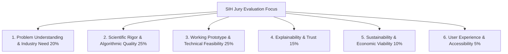

# SIH Evaluation & Demonstration Strategy

**Document Type:** Hackathon Evaluation & Presentation Framework  
**Problem Statement ID:** SIH26236  
**Primary Source:** [docs/Problem_Statement.md](file:///d:/Food-Packaging-AI/docs/Problem_Statement.md)  
**Product Requirements:** [docs/PRD.md](file:///d:/Food-Packaging-AI/docs/PRD.md)  
**System Design:** [docs/System_Design.md](file:///d:/Food-Packaging-AI/docs/System_Design.md)  

---

## 1. Hackathon Evaluation Dimensions

The project is structured to excel across the 6 primary evaluation criteria utilized by Smart India Hackathon (SIH) juries:

1. **Problem Understanding & Industry Need:** Articulates the severe economic and nutritional loss caused by empirical, unguided packaging selection in Indian agriculture and MSMEs.
2. **Scientific Rigor & Algorithmic Quality:** Demonstrates that recommendation logic is grounded in thermodynamics, ASTM test standards, and postharvest respiration kinetics—not speculative AI hallucinations.
3. **Working Prototype & Technical Feasibility:** Delivers an instant, responsive web application executing real calculations on a local/hosted modular architecture.
4. **Explainability & Trust:** Features transparent Explanation Cards answering *why* materials were chosen or disqualified, complete with bibliographic source citations.
5. **Sustainability & Circularity:** Highlights recyclable mono-materials and compostable options alongside traditional laminates, addressing Plastic Waste Management Rules.
6. **User Experience & Accessibility:** An intuitive decision-support layout accessible to non-technical farmers and small food entrepreneurs.

---

## 2. Metrics Classification & Measurable Prototype Quality

To maintain absolute academic and scientific integrity, metrics are strictly categorized:

| Metric Category | Metric Name | Prototype Target / Status | Measurement Method |
| :--- | :--- | :--- | :--- |
| **Measured Metric** | **Input Validation Coverage** | **100%** | Automated tests verifying rejection of out-of-bounds/contradictory parameters. |
| **Measured Metric** | **Produce Respiration Branching** | **100%** | Unit tests ensuring respiring crops never receive airtight barrier recommendations. |
| **Measured Metric** | **Safety Warning Enforcement** | **100%** | Tests verifying *C. botulinum* warning on low-acid anaerobic food evaluations. |
| **Measured Metric** | **Response Latency** | **< 1.0 second** | Measured round-trip API time for recommendation generation under local test. |
| **Planned Metric** | **Curated Benchmark Coverage** | **25+ commodities, 15+ materials** | Number of verified entries in `data/processed/` database fixtures. |
| **Planned Metric** | **Specification Completeness** | **7 of 7 specifications** | OTR, WVTR, Gauge, Sealability, Permeability, Strength, and MAP suitability. |
| **TBD Metric** | **Commercial Shelf-Life Extension** | **TBD** *(Requires commercial pack-house trials post-hackathon)* | Cannot be ethically claimed without empirical laboratory accelerated shelf-life testing. |
| **TBD Metric** | **Industry Food Waste Reduction %** | **TBD** *(Requires multi-season field validation)* | Real-world field adoption study metric. |

---

## 3. SIH Live Demonstration Scripts

### 3.1 The 3-Minute Rapid Demonstration (Elevator / Round 1 Pitch)
- **0:00 - 0:45 (The Problem & The Hook):**
  - *"Judges, small food manufacturers, startups, and farmers lose up to 30% of their product value simply because they pick the wrong packaging from local vendors. They don't know OTR from WVTR. Our system bridges this gap with an intelligent, evidence-backed decision support platform."*
- **0:45 - 1:45 (Live Scenario A: Dry Snack Spoilage):**
  - Select **Potato Chips** preset ($30\%$ fat, $2\%$ moisture, $30^\circ\text{C}, 80\%\text{ RH}$).
  - Hit **Generate Recommendation**.
  - Show the output: Recommends **Metallized BoPET/PE**.
  - Highlight the **Explanation Card**: *"Notice how the system explains that high fat requires an OTR < 2.5 to prevent rancidity and disqualifies plain LDPE because its high oxygen permeability would cause off-flavors in 14 days."*
- **1:45 - 2:30 (Live Scenario B: Fresh Produce Respiration):**
  - Switch to **Fresh Broccoli** preset ($4^\circ\text{C}$, respiring produce).
  - Hit **Generate Recommendation**.
  - Point to the produce branch: *"Instead of an airtight bag that suffocates broccoli and creates foul sulfur odors, the system recommends Micro-Perforated LDPE, calculating a safe equilibrium MAP headspace of 1-2% O2 and 5-10% CO2."*
- **2:30 - 3:00 (Impact & Safety):**
  - Show the **Citations Link** and **QR Code export**.
  - Close: *"We provide actionable, ASTM-standardized specifications that farmers and MSMEs can directly hand over to packaging converters. Thank you."*

---

### 3.2 The 5-Minute In-Depth Demonstration (Finals / Jury Panel)
- **0:00 - 1:00 (Context & Architecture):**
  - Introduce SIH Problem Statement SIH26236.
  - Explain the modular architecture (FastAPI + React) and why domain-guided physics was chosen over black-box neural networks for food safety.
- **1:00 - 2:15 (Scenario 1: Oxidation & Moisture Barrier in Dry Goods):**
  - Walk through potato chips; adjust the ambient humidity slider from $50\%$ to $90\%\text{ RH}$.
  - Show how the calculated allowable WVTR tightens dynamically, moving from standard BoPET/PE to a high-barrier Metallized or Foil laminate.
- **2:15 - 3:30 (Scenario 2: Fresh Produce & Respiration Physics):**
  - Demonstrate fresh broccoli and mushrooms.
  - Show the micro-perforation specification and Graham's law pore-diffusion ratio ($\approx 0.81$).
  - Demonstrate the **Safety Guardrail**: show what happens if a user submits a low-acid food under anaerobic conditions, highlighting the botulism warning.
- **3:30 - 4:15 (Scenario 3: Sustainability & Circular Economy):**
  - Toggle the **Prioritize Eco-Friendly** slider.
  - Show how the ranking algorithm elevates recyclable mono-material **BoPE/PE** over unrecyclable multi-material foil laminates, displaying the recyclability stream and trade-off in barrier safety margin.
- **4:15 - 5:00 (Questions & Future Roadmap):**
  - Demonstrate QR code specification export.
  - Summarize the scientific safety boundary and transition into jury Q&A.
