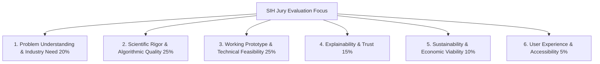

# SIH Evaluation & Demonstration Strategy

**Document Type:** Hackathon Evaluation & Presentation Framework  
**Problem Statement ID:** SIH26236  
**Primary Source:** [docs/Problem_Statement.md](file:///d:/Food-Packaging-AI/docs/Problem_Statement.md)  
**Product Requirements:** [docs/PRD.md](file:///d:/Food-Packaging-AI/docs/PRD.md)  
**System Design:** [docs/System_Design.md](file:///d:/Food-Packaging-AI/docs/System_Design.md)  

---

## 1. Hackathon Evaluation Dimensions

The project is structured to excel across the 6 primary evaluation criteria utilized by Smart India Hackathon (SIH) juries:

1. **Problem Understanding & Industry Need:** Articulates the severe economic and nutritional loss caused by empirical, unguided packaging selection in Indian agriculture and MSMEs.
2. **Scientific Rigor & Algorithmic Quality:** Demonstrates that recommendation logic is grounded in thermodynamics, ASTM test standards, and postharvest respiration kinetics—not speculative AI hallucinations.
3. **Working Prototype & Technical Feasibility:** Delivers an instant, responsive web application executing real calculations on a local/hosted modular architecture.
4. **Explainability & Trust:** Features transparent Explanation Cards answering *why* materials were chosen or disqualified, complete with bibliographic source citations.
5. **Sustainability & Circularity:** Highlights recyclable mono-materials and compostable options alongside traditional laminates, addressing Plastic Waste Management Rules.
6. **User Experience & Accessibility:** An intuitive decision-support layout accessible to non-technical farmers and small food entrepreneurs.

---

## 2. Metrics Classification & Measurable Prototype Quality

To maintain absolute academic and scientific integrity, metrics are strictly categorized:

| Metric Category | Metric Name | Prototype Target / Status | Measurement Method |
| :--- | :--- | :--- | :--- |
| **Measured Metric** | **Input Validation Coverage** | **100%** | Automated tests verifying rejection of out-of-bounds/contradictory parameters. |
| **Measured Metric** | **Produce Respiration Branching** | **100%** | Unit tests ensuring respiring crops never receive airtight barrier recommendations. |
| **Measured Metric** | **Safety Warning Enforcement** | **100%** | Tests verifying *C. botulinum* warning on low-acid anaerobic food evaluations. |
| **Measured Metric** | **Response Latency** | **< 1.0 second** | Measured round-trip API time for recommendation generation under local test. |
| **Planned Metric** | **Curated Benchmark Coverage** | **25+ commodities, 15+ materials** | Number of verified entries in `data/processed/` database fixtures. |
| **Planned Metric** | **Specification Completeness** | **7 of 7 specifications** | OTR, WVTR, Gauge, Sealability, Permeability, Strength, and MAP suitability. |
| **TBD Metric** | **Commercial Shelf-Life Extension** | **TBD** *(Requires commercial pack-house trials post-hackathon)* | Cannot be ethically claimed without empirical laboratory accelerated shelf-life testing. |
| **TBD Metric** | **Industry Food Waste Reduction %** | **TBD** *(Requires multi-season field validation)* | Real-world field adoption study metric. |

---

---

## 3. Final 8-Scenario Evaluation Matrix

The evaluation matrix (`data/evaluation/prototype_evaluation_cases.json` and `backend/tests/test_evaluation_matrix.py`) formally tests the system across 8 reproducible engineering scenarios:

| Scenario ID | Commodity | Primary Physical Driver | Input Regime | Expected System Behavior & Target Specs | Status |
| :--- | :--- | :--- | :--- | :--- | :--- |
| **Scenario A** | Fried Potato Chips | Moisture crispness & lipid oxidation | Ambient, 25°C, 75% RH, 180d | WVTR $\le 2.5\text{ g/(m}^2\cdot\text{day)}$, OTR $\le 2.0\text{ cm}^3\text{/(m}^2\cdot\text{day}\cdot\text{atm)}$, opaque light barrier required. Ranks MET-PET/PE or PET/ALU/PE. | **SUPPORTED** |
| **Scenario B** | Roasted Peanuts | Lipid peroxidation ($49\%$ oil) | Ambient, 22°C, 55% RH, 90d | High lipid fraction strictly mandates OTR $\le 2.0\text{ cm}^3\text{/(m}^2\cdot\text{day}\cdot\text{atm)}$. Deterministic candidate ordering. | **SUPPORTED** |
| **Scenario C** | Fresh Broccoli | Coupled respiration ($60\text{ mg CO}_2\text{/(kg}\cdot\text{h)}$) | Chilled, 4°C, 95% RH, 14d | Laser micro-perforated film (`PERF-BOPP/PE`), adjusted respiration rate $60.07\text{ mg CO}_2\text{/(kg}\cdot\text{h)}$, dense foil/metallized films rejected (hypoxia hazard). Preference cannot bypass hard safety bounds. | **SUPPORTED** |
| **Scenario D** | Quick-Frozen Peas | Sublimation & cold embrittlement | Frozen, -18°C, 85% RH, 180d | Non-respiring in frozen state (no produce UI). WVTR $\le 18.0\text{ g/(m}^2\cdot\text{day)}$. Low-temperature embrittlement caution attached for rigid bio-polyesters. | **SUPPORTED** |
| **Scenario E** | Tomato Paste | Carotenoid fading & mold (pH=4.1) | Ambient, 25°C, 65% RH, 60d | High-acid commodity context ($\text{pH} < 4.6$): OTR $\le 60.0\text{ cm}^3\text{/(m}^2\cdot\text{day}\cdot\text{atm)}$ to mitigate lycopene fading. Microbial pathogens inhibited naturally by acidity. | **SUPPORTED** |
| **Scenario F** | Unverified Crop | Missing equilibrium gas data | Chilled, 4°C, 90% RH, 7d | Explicit `[RESEARCH REQUIRED]` uncertainty note. Refuses to hallucinate unverified $\text{O}_2/\text{CO}_2$ gas mixtures. | **RESEARCH_REQUIRED** |
| **Scenario G** | Restricted Catalog | Insufficient available barrier | Ambient, 25°C, 75% RH, 180d | Available materials fail ASTM barrier limits. Status `RESEARCH_REQUIRED`, primary is `None`, zero false-positive recommendations, all disqualified materials retain explicit rejection reasons. | **RESEARCH_REQUIRED** |
| **Scenario H** | Invalid Input | Contradictory physics (frozen at +25°C) | Frozen regime at +25°C | Sanitized HTTP 422 `VALIDATION_ERROR`. Zero traceback or filesystem path leaks. | **VALIDATION_ERROR** |

---

## 4. Claims & Evidence Classification Audit

Every substantive user-facing claim across the UI, API, and documentation is audited and classified under one of 5 formal evidentiary categories:

| Claim Category | Definition & Standard | Prototype Instances |
| :--- | :--- | :--- |
| `[EXTERNAL EVIDENCE]` | Directly derived from peer-reviewed literature, ASTM standards, or official compendiums. | ASTM F1249-20 (WVTR), ASTM D3985-17 (OTR), Fonseca 2002 $Q_{10}$ respiration scaling, Kader 2002 produce postharvest gas thresholds, USDA/FDA microbial boundaries. |
| `[INFERENCE]` | Deterministic logical or mathematical derivation from coupled physical mass balances. | Equilibrium OTR calculation $OTR_{eq} = \text{Daily } \text{O}_2 / (\text{Area} \cdot \Delta \text{O}_2)$, vapor pressure gradient via Tetens equation, respiration temperature scaling $R(T) = R(T_{ref}) \cdot Q_{10}^{(\Delta T / 10)}$. |
| `[PROTOTYPE ASSUMPTION]` | Explicit engineering baseline chosen to enable prototype evaluation where empirical variance is high. | Baseline pouch geometry (100g product / 0.06 m² area), linear water vapor permeance scaling, steady-state isothermal storage (no diurnal cycling), multi-criteria MCDA weights (50/30/20 balanced, 40/45/15 sustainability, 40/15/45 cost). |
| `[RESEARCH REQUIRED]` | Boundary flag indicating where empirical laboratory data is missing in the scientific literature. | Headspace gas compositions for rare/uncharacterized crops, exact real-world pouch pinholing rates beyond 365 days, Arrhenius permeation coefficients at ambient temperatures $> 40^\circ\text{C}$. |
| `[CONTEXT DEPENDENT]` | Technical factors that depend on packaging equipment, seal design, or supply chain factors. | Heat seal initiation temperature (SIT), drop/puncture resistance during rough transit (ASTM D4169/F1306), secondary UV carton shielding for transparent photo-sensitive films. |

---

## 5. Alternative Recommendation Audit

The secondary candidate selection logic (`backend/app/domain/ranking.py`) was audited against the following criteria:
1. **Qualification Integrity:** The alternative recommendation is strictly drawn from ranked candidates with status `ELIGIBLE` or `CONDITIONALLY_ELIGIBLE`. Disqualified materials are never eligible as alternatives.
2. **Distinctness:** The alternative material ID strictly differs from the primary recommendation (`alternative.material_id != primary.material_id`).
3. **Documented Trade-Off Logic:** The alternative selection algorithm seeks a qualified peer that offers superior circularity (`sustainability_score > primary.sustainability_score`) or favorable economics (`cost_score > primary.cost_score`), providing the user with an actionable, transparent trade-off.
4. **Graceful Null Fallback:** When only a single candidate qualifies or no viable alternative meets the trade-off criteria, `alternative_recommendation` returns `null` with the explicit rationale: *"No distinct secondary viable candidate met constraint thresholds."*

---

## 6. Demonstration Mode Safety & Non-Certification Guardrails

The prototype strictly enforces anti-hallucination and non-certification safety rules:
- **No Fabricated Confidence Metrics:** The UI displays mathematically defined MCDA Composite Utility scores ($U \in [0, 100]$) rather than misleading "AI Confidence" or "Accuracy" percentages.
- **No False Shelf-Life Guarantees:** All target specifications are presented as *indicative engineering targets* rather than certified shelf-life guarantees.
- **Mandatory Regulatory Disclaimer:** Every recommendation session surfaces the disclaimer: *"Recommendations represent decision-support engineering estimates and do NOT constitute accredited laboratory test validation (ASTM F1249/D3985), regulatory compliance certificates (FSSAI/FDA), or shelf-life guarantees. Commercial deployment requires accelerated shelf-life testing (ASLT) and migration testing (IS 9845)."*

---

## 7. Implemented Prototype Capabilities vs. Research / Future Validation

```mermaid
flowchart LR
    subgraph Implemented[Implemented & Automated in Prototype]
        I1[ASTM F1249/D3985 Target Derivation]
        I2[Fonseca 2002 Q10 Respiration Kinetics]
        I3[Coupled Mass-Balance OTR_eq]
        I4[Microperforation Venting Logic]
        I5[MCDA Multi-Attribute Trade-Offs]
        I6[Deterministic Tie-Breaking & 10 Invariants]
        I7[Sanitized Validation & Error Boundaries]
    end

    subgraph Future[Requires Empirical / Physical Laboratory Validation]
        F1[Physical Accelerated Shelf-Life Testing ASLT]
        F2[ASTM F1306 Puncture & D4169 Drop Testing]
        F3[Microbial Challenge Testing C. botulinum]
        F4[FSSAI / FDA Overall Migration IS 9845]
        F5[Commercial Multi-Season Field Packhouse Trials]
    end

    Implemented -->|Provides Specifications For| Future
```

---

## 8. SIH Live Demonstration Scripts

### 8.1 The 3-Minute Rapid Demonstration (Evaluator Pitch)
- **0:00 - 0:45 (The Problem & Industry Reality):**
  - *"Jury members, small food processors and farmers lose up to 30% of their produce value due to improper packaging selection. They lack the engineering lab access needed to derive OTR and WVTR specifications. Our system delivers a deterministic, evidence-backed decision support engine."*
- **0:45 - 1:45 (Scenario 1: Crispy Snack Spoilage & Trade-Offs):**
  - Select **Potato Chips** ($a_w=0.20$, high fat $34\%$, ambient $25^\circ\text{C}, 75\%\text{ RH}$).
  - Hit **Generate Recommendation**.
  - Show the output: Primary recommendation is **Metallized BOPP/PE** (or **PET/ALU/PE**).
  - Point to Technical Specs: Target WVTR $\le 2.5\text{ g/(m}^2\cdot\text{day)}$, OTR $\le 2.0\text{ cm}^3\text{/(m}^2\cdot\text{day}\cdot\text{atm)}$.
  - Click **Sustainability Priority**: Show how recyclable mono-material **BoPE/PE** shifts upward in ranking, showing the transparent trade-off in barrier safety margin.
- **1:45 - 2:30 (Scenario 2: Fresh Produce & MAP Respiration):**
  - Switch commodity to **Fresh Broccoli** (chilled $4^\circ\text{C}$, respiring produce).
  - Hit **Generate Recommendation**.
  - Highlight the produce branch: *"Instead of an airtight pouch that suffocates broccoli and creates foul sulfur off-odors, the system disqualifies dense foil laminates with a 'Severe Hypoxia' warning and recommends laser micro-perforated film (`PERF-BOPP/PE`), deriving equilibrium OTR demand under coupled mass balance."*
- **2:30 - 3:00 (Traceability, Safety & Wrap-up):**
  - Show the **Scientific Evidence Traceability Panel** linking decisions directly to peer-reviewed sources (Fonseca 2002, Robertson 2012, ASTM standards).
  - Conclude: *"Our system provides actionable, ASTM-aligned engineering specifications that food processors can hand directly to packaging converters. Thank you."*

---

### 8.2 The 5-Minute In-Depth Demonstration (Finals / Technical Jury)
- **0:00 - 1:00 (System Design & Algorithmic Quality):**
  - Introduce SIH Problem Statement SIH26236.
  - Explain the modular architecture (FastAPI + React 19 + TypeScript + SQLite) and why deterministic domain physics was chosen over black-box ML to eliminate catastrophic food safety hallucinations.
- **1:00 - 2:15 (Scenario A: Dry Goods Moisture & Lipid Rancidity):**
  - Walk through potato chips; adjust ambient relative humidity from $50\%$ to $90\%\text{ RH}$.
  - Demonstrate dynamic tightening of permissible WVTR flux via linear permeance scaling across vapor pressure gradient.
  - Show the light sensitivity flag requiring opaque metallization or carton secondary packaging.
- **2:15 - 3:30 (Scenario C: Respiration Kinetics & Produce Safety):**
  - Demonstrate Fresh Broccoli at $4^\circ\text{C}$ vs $15^\circ\text{C}$.
  - Explain the $Q_{10}$ Arrhenius temperature scaling doubling respiration demand.
  - Show why continuous films fail and micro-perforations are demanded to vent $\text{CO}_2$.
  - Demonstrate the **Food Safety Advisory Interceptor** warning against anaerobiosis in low-acid foods.
- **3:30 - 4:15 (Multi-Criteria Optimization & Invariant Safety):**
  - Demonstrate the 3-way preference selector (**Balanced**, **Sustainability Priority**, **Cost Priority**).
  - Emphasize **Invariant 9**: soft preference weights only re-order viable candidates—they can *never* rescue a disqualified material that violates physical barrier or food safety thresholds.
- **4:15 - 5:00 (Auditability, Limitations & Questions):**
  - Highlight the **Documented Assumptions** and **Scientific Limitations** panels.
  - Show zero traceback leakage on invalid inputs (Scenario H).
  - Transition into technical jury Q&A.

