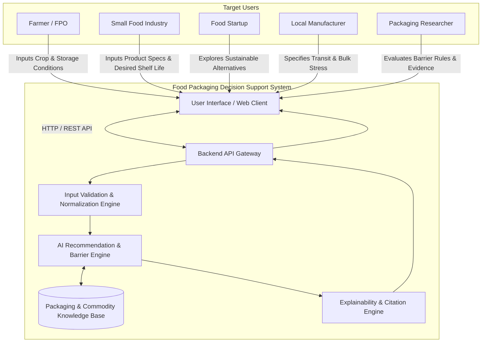
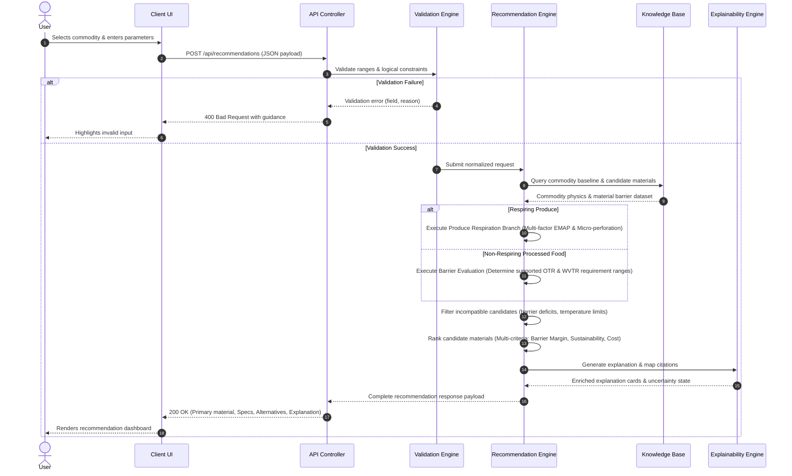
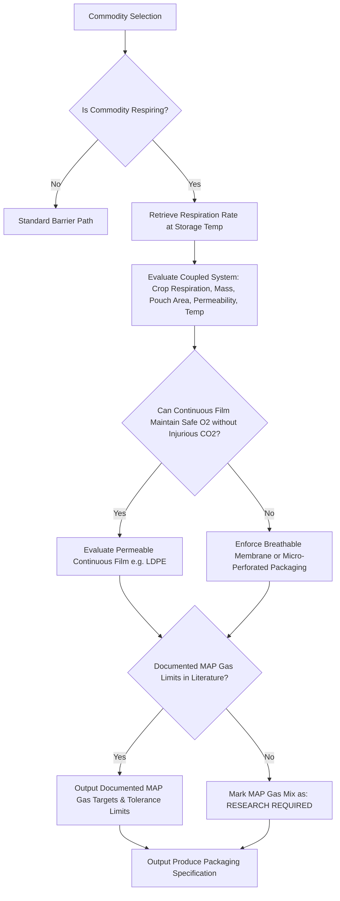

# System Design: AI-Based Food Packaging Recommendation System

**Document Type:** Logical System Design  
**Problem Statement ID:** SIH26236  
**Primary Source:** [docs/Problem_Statement.md](file:///d:/Food-Packaging-AI/docs/Problem_Statement.md)  
**Product Requirements:** [docs/PRD.md](file:///d:/Food-Packaging-AI/docs/PRD.md)  
**Scientific Foundation:** [docs/Research_and_Evidence.md](file:///d:/Food-Packaging-AI/docs/Research_and_Evidence.md)  

---

## 1. System Context & Actors

The system operates as an intelligent, evidence-backed **decision-support platform**. It does not perform physical laboratory testing; it models food preservation physics and material barrier science to generate actionable packaging recommendations.

### 1.1 Actors & Interactions
1. **Farmers / FPOs:** Provide fresh crop type and ambient/cold transit data; receive produce respiration classification, breathable/perforated film guidance, and safe MAP gas composition where documented.
2. **Small Food Processors:** Provide moisture %, fat %, and shelf-life target; receive primary laminate recommendations (e.g. MET-PET/PE), supported OTR/WVTR requirement ranges, and nominal gauge.
3. **Food Startups:** Provide product characteristics; receive comparative trade-offs between conventional multi-material laminates and recyclable mono-materials (e.g. BoPE/PE) or certified compostable films.
4. **Local Manufacturers:** Provide transit severity; receive mechanical puncture resistance, tear strength, and seal integrity specifications.
5. **Packaging Researchers:** Inspect rule thresholds, examine scientific citations, and evaluate candidate disqualification logs.

---

## 2. Core Logical Flows

### 2.1 Recommendation Generation Flow

---

## 3. Subsystem Architecture & Detailed Logic

### 3.1 Input Validation & Normalization Engine
- **Responsibility:** Sanitizes user inputs, enforces physical boundaries ($0 \le \text{moisture} \le 100\%$, $0 \le \text{fat} \le 100\%$, $1 \le pH \le 14$), checks environmental consistency (e.g., verifying that `Frozen` storage temperature is $\le -18^\circ\text{C}$), and normalizes units into standard SI / ASTM metrics ($^\circ\text{C}$, $\text{cm}^3/(\text{m}^2 \cdot \text{day} \cdot \text{atm})$, $\text{g}/(\text{m}^2 \cdot \text{day})$).

### 3.2 Barrier Requirement & Spoilage Evaluation Subsystem
- **Moisture Kinetics:** Determines the partial pressure gradient $\Delta p_w = p_{sat}(T) \cdot (\text{RH}_{ext}/100 - a_w)$. For moisture-sensitive dry goods ($a_w < 0.40$), derives a conditional target requirement range for WVTR based on nominal surface-area-to-volume ratio ($A/V$), product mass, and target shelf life.
- **Lipid Oxidation & Gas Sensitivity:** Evaluates fat content and desired shelf life. High-fat formulations trigger a strict target OTR range ($\le 1.0 - 2.5\ \text{cm}^3/(\text{m}^2 \cdot \text{day} \cdot \text{atm})$) and mandate light-blocking/metallized substrates.
- **Microbial Safety & Acid Classification:** Evaluates pH and storage atmosphere:
  - $pH < 4.6$ (High Acid): Spoilage governed by molds/yeasts; anaerobic vacuum/MAP packaging does not present *C. botulinum* risks.
  - $pH \ge 4.6$ (Low Acid): When evaluated under anaerobic or reduced-oxygen packaging at temperatures $> 3^\circ\text{C}$, the system attaches a contextual safety advisory warning of *Clostridium botulinum* hazards and noting that commercial food safety requires licensed process validation.

### 3.3 Fresh Produce & Respiration Branch

- **Rule:** Fresh produce packaging evaluates the coupled interaction between commodity respiration rate, produce mass, packaging surface area, storage temperature, and gas permeation rates. Continuous barrier films are disqualified only when mass transfer calculations show that film transmission cannot sustain oxygen above the critical extinction limit without toxic carbon dioxide accumulation.

### 3.4 Candidate Filtering & Multi-Criteria Ranking
1. **Hard Filtering (Constraint Elimination):**
   - Eliminates materials whose WVTR fails to satisfy the supported requirement range.
   - Eliminates materials whose OTR fails to satisfy the supported requirement range.
   - Eliminates materials that undergo brittle fracture at target storage temperature (e.g., rigid plastics in frozen mode).
   - Eliminates packaging structures whose gas exchange rates induce anaerobic asphyxiation or excessive condensation for the specific produce crop and geometry.
2. **Multi-Criteria Ranking:**
   - Evaluates remaining viable candidates across 3 dimensions:
     - **Barrier Safety Margin:** How reliably the material's transmission falls within target requirement ranges.
     - **Sustainability & Circularity Index:** Favoring recyclable mono-materials (e.g. all-PE) over unrecyclable multi-material laminates.
     - **Relative Economic Index:** Normalized cost multiplier (baseline LDPE = 1.0) `[PROTOTYPE ASSUMPTION]`.
   - Produces the Primary Recommendation alongside an explicit Eco-Friendly/Recyclable Alternative.

### 3.5 Explainability & Traceability Engine
- Every recommendation is accompanied by an **Explanation Model**:
  - `primary_driver`: The dominant physical/biological vulnerability (e.g., *"Fat content 32% requires strict oxygen exclusion to avoid rancidity"*).
  - `disqualified_candidates`: Structured list of rejected common materials with specific constraint failure reasons (e.g., *"LDPE rejected: OTR exceeds the supported requirement range for high-fat shelf-stable goods"*).
  - `citations`: Array of `reference_id` keys linking to peer-reviewed postharvest literature or ASTM standards.
  - `safety_advisories`: Any contextual pathogen or temperature-abuse alerts (e.g., reduced-oxygen advisory for low-acid food).

---

## 4. Uncertainty & State Management

The logical engine explicitly reports one of 4 system states for every query:

| System State | Criteria | UI Behavior & Output |
| :--- | :--- | :--- |
| **1. Supported Recommendation** | Full commodity physics, verified material barrier data, and standards citations present. | Full primary recommendation, complete ASTM specifications, alternatives, and detailed explanation card. |
| **2. Conditional Recommendation** | Valid recommendation, but relies on specific operational assumptions (e.g., unbroken cold chain, standard pouch geometry). | Full recommendation rendered with prominent condition badges and risk warnings. |
| **3. Insufficient Evidence** | User supplied custom commodity without required baseline parameters ($a_w$, fat %, respiration). | Halts recommendation generation; highlights missing parameters and prompts user to input required values. |
| **4. Research Required** | Query involves a cultivar or packaging concept lacking published literature (e.g. unverified MAP gas mixture). | Recommends base barrier class, but explicitly marks gas composition or specific threshold as `[RESEARCH REQUIRED]`. |

---

## 5. Security, Validation & Scale Assumptions

### 5.1 Security & Integrity Guardrails
- **Backend as Source of Truth:** All threshold matching, candidate filtering, and validation execute on the server. The client is strictly an input/display layer.
- **Input Sanitization:** Strict type checking, numerical clamping, and rejection of unexpected fields to prevent injection or invalid state manipulation.
- **Safe Error Reporting:** Errors return standardized JSON error schemas with user-friendly remediation messages; internal system stack traces are never leaked.

### 5.2 Prototype Scale Assumptions `[PROTOTYPE ASSUMPTION]`
- **Design Target:** Hackathon demonstration and evaluation by small teams/evaluators.
- **Traffic Profile:** $\le 5$ requests per second peak; catalog size of benchmark commodities and packaging materials.
- **Data Persistence:** In-memory or indexed relational store. No distributed caching (Redis) or microservice orchestration is required.

---

## 6. Out-of-Scope & Intentional Trade-offs

### 6.1 Explicitly Out-of-Scope
- Real-time finite-element non-isothermal shelf-life decay simulation.
- Live API integration for commercial polymer resin commodity trading markets.
- Physical IoT sensor hardware integration.
- Commercial multi-tenant enterprise billing or role-based access control.

### 6.2 Key Architectural Trade-offs
1. **Explainable Deterministic Matching vs. Black-Box Deep Learning:**
   - *Decision:* Adopt deterministic, rule-guided barrier calculation coupled with transparent multi-criteria ranking.
   - *Rationale:* Food safety and packaging converters require standardized, traceable ASTM units (e.g. OTR $< 2.5\ \text{cm}^3$) and transparent criteria. Deep neural networks acting as black boxes cannot provide reliable safety guarantees or audit trails.
2. **Curated Benchmark Catalog vs. Open-Ended Web Scraping:**
   - *Decision:* Restrict primary recommendation matching to rigorously curated, citation-backed commodity records.
   - *Rationale:* Eliminates hallucinated respiration rates and invalid critical water activity thresholds.
