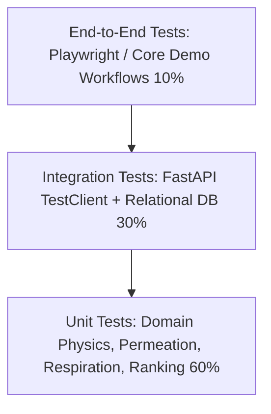

# Testing and Security Strategy: Food Packaging AI

**Document Type:** Verification & Security Strategy  
**Problem Statement ID:** SIH26236  
**Primary Source:** [docs/Problem_Statement.md](file:///d:/Food-Packaging-AI/docs/Problem_Statement.md)  
**System Architecture:** [docs/Architecture.md](file:///d:/Food-Packaging-AI/docs/Architecture.md)  
**Rules & Discipline:** [docs/Rules.md](file:///d:/Food-Packaging-AI/docs/Rules.md)  

---

## 1. Testing Philosophy & Test Pyramid

Testing in this project is designed to prove that **food physics and recommendation rules execute reliably and safely**.

### Core Testing Mandates
1. **Never Edit a Test to Pass:** If a test fails, the bug is in the calculation or code. Never weaken test assertions.
2. **Real Physics, No Business Logic Mocks:** Unit tests for barrier matching and respiration kinetics must test real mathematical functions, not mocks.
3. **The "Don't Fool Me" Verification Standard:** Every task completion must demonstrate executed test logs with zero failures and zero quietly skipped tests.

---

## 2. Test Coverage Specifications

### 2.1 Recommendation Engine Test Suite
The recommendation engine must pass 7 distinct categories of unit tests:

| Test Category | Test Case Description | Expected Verification |
| :--- | :--- | :--- |
| **Normal Case (Dry Snack)** | Potato chips ($30\%$ fat, $2\%$ moisture, $30^\circ\text{C}, 80\%\text{ RH}$, 180 days). | Asserts OTR $< 2.5$, WVTR $< 1.5$; selects Metallized Film (MET-PET/PE); rejects plain LDPE. |
| **Normal Case (Fresh Produce)** | Fresh broccoli (high respiration, $4^\circ\text{C}$). | Asserts produce respiration branch evaluates gas balance; identifies asphyxiation risk for continuous barrier films; recommends Micro-Perforated LDPE; asserts safe headspace $\text{O}_2 \ge 1.0\%$. |
| **Normal Case (Dairy Powder)** | Whole milk powder ($a_w < 0.25$, high moisture sensitivity). | Asserts strict WVTR requirement ($< 1.0\ \text{g}$); recommends multi-layer aluminum or metallized barrier. |
| **Boundary Case (Moisture Extremes)**| Input moisture at physical boundaries ($0.0\%$ and $100.0\%$). | Asserts valid calculation without division-by-zero or negative flux anomalies. |
| **Boundary Case (Frozen Storage)** | Storage mode `Frozen` at $-18^\circ\text{C}$. | Asserts materials with glass transition $T_g > -18^\circ\text{C}$ are disqualified due to cold-embrittlement risk; selects LDPE sealant. |
| **Invalid Input Case** | Moisture $> 100\%$, $pH < 1.0$, or temperature $> 60^\circ\text{C}$. | Asserts Pydantic validation rejects payload with HTTP 422 / 400 and clear error message. |
| **Conflicting Input Case** | Storage mode `Frozen` paired with temperature $+25^\circ\text{C}$. | Asserts domain validator catches logical contradiction and rejects request. |
| **Missing Parameter Case** | Custom commodity submitted without critical water activity $a_w$. | Asserts engine transitions to `[INSUFFICIENT EVIDENCE]` state and requests missing input. |
| **Unsupported Crop Case** | Crop lacking published postharvest MAP data. | Asserts engine outputs base packaging material but marks MAP gas mixture as `[RESEARCH REQUIRED]`. |
| **Safety Guardrail Case** | Low-acid food ($pH \ge 4.6$) in anaerobic hermetic packaging at $>3^\circ\text{C}$. | Asserts mandatory *Clostridium botulinum* safety advisory is attached to output. |

### 2.2 API & Integration Testing
- **Contract Verification:** Automated tests verify that `POST /api/recommendations` returns all 7 required packaging specifications in ASTM units matching the Pydantic response schema.
- **Error Handling:** Integration tests verify that malformed JSON, SQL injection payloads, or missing headers return clean, structured error responses without leaking tracebacks.
- **Database Integrity:** Tests verify that foreign key relationships between commodities, properties, and bibliographic evidence are strictly maintained on database inserts.

### 2.3 Frontend & End-to-End (E2E) Testing
- **Form Interaction:** Tests verify that selecting a commodity dropdown immediately updates the baseline preview sliders.
- **State Transitions:** E2E tests verify that submitting a query transitions through the loading skeleton to the populated results grid in $\le 1.0\text{ second}$.
- **Responsive Layout:** Visual regression checks verify that the layout renders cleanly without element clipping at 375px mobile viewport width.

### 2.4 Recommendation Invariants & Reliability Guarantees (Phase 9)
The recommendation pipeline enforces 10 strict mathematical and architectural invariants (`backend/tests/test_recommendation_reliability.py`):
1. **Invariant 1 (Qualification Purity):** Every ranked candidate is verified as `ELIGIBLE` or `CONDITIONALLY_ELIGIBLE`.
2. **Invariant 2 (Disqualification Traceability):** Every disqualified candidate has at least one documented rejection reason citing the failed ASTM threshold.
3. **Invariant 3 (Rank Contiguity):** Candidate ranks are contiguous and deterministic ($1, 2, \dots, N$).
4. **Invariant 4 (Primary Selection Authority):** Primary recommendation is strictly the first ranked qualified candidate ($rank = 1$).
5. **Invariant 5 (Alternative Distinctness):** Alternative recommendation, when present, is a distinct qualified candidate with superior circularity or lower cost.
6. **Invariant 6 (Composite Utility Conservation):** $U(m) = w_b \cdot S_b + w_s \cdot S_s + w_c \cdot S_c$ equals the exact sum of contribution fields within documented 4-decimal rounding.
7. **Invariant 7 (Weight Normalization):** Applied weights strictly sum to $1.0000 \pm 0.0001$.
8. **Invariant 8 (Weight Attribution):** Applied weights strictly correspond to the selected `OptimizationPreference` preset.
9. **Invariant 9 (Constraint Immunity):** Changing soft preference weights alters candidate order only; disqualified candidates can never be rescued or promoted.
10. **Invariant 10 (Research Integrity):** Produce lacking verified MAP mixtures or uncharacterized commodities explicitly output `RESEARCH_REQUIRED` / `INSUFFICIENT_EVIDENCE` without synthesizing fabricated gas compositions.

### 2.5 Final Evaluation Matrix & Golden Cases Suite (Phase 11)
The test suite includes the formal 8-scenario golden evaluation suite (`data/evaluation/prototype_evaluation_cases.json` and `backend/tests/test_evaluation_matrix.py`):
1. **Scenario A (Potato Chips):** Ambient crispy snack; asserts WVTR $\le 2.5$, OTR $\le 2.0$, and light barrier requirement.
2. **Scenario B (Roasted Peanuts):** High lipid fraction ($49\%$); asserts OTR $\le 2.0$ and determinism on repeat queries.
3. **Scenario C (Fresh Broccoli):** High respiration ($60.07\text{ mg CO}_2\text{/(kg}\cdot\text{h)}$ at 4°C); asserts microperforation requirement, disqualification of dense foil, and preference constraint immunity.
4. **Scenario D (Frozen Peas):** Sub-zero storage (-18°C); asserts WVTR $\le 18.0$, non-respiring state, and bio-film embrittlement caution.
5. **Scenario E (Tomato Paste):** High-acid food ($\text{pH} < 4.6$); asserts OTR $\le 60.0$ to prevent lycopene bleaching.
6. **Scenario F (Research-Required Produce):** Unverified produce; asserts explicit `RESEARCH_REQUIRED` status and refusal to fabricate gas mixes.
7. **Scenario G (Catalog Failure):** Catalog lacking required barrier; asserts clean `RESEARCH_REQUIRED` status with 0 false positives and full rejection reasons.
8. **Scenario H (Invalid Input):** Physical contradiction (frozen at +25°C); asserts sanitized HTTP 422 with zero traceback leakage.

---

## 3. Security Strategy & Threat Mitigations

Although this is a decision-support prototype, security hygiene must be maintained across all 5 standard threat dimensions:

### 3.1 Input Validation & Injection Prevention
- **Threat:** Malicious string injection or malformed payloads aimed at database extraction or server execution.
- **Mitigation:**
  - Pydantic v2 schemas enforce strict types, numerical boundaries, and regex validations on all API inputs.
  - SQLAlchemy ORM uses parameterized queries exclusively; no raw SQL string concatenation is permitted.

### 3.2 Cross-Site Scripting (XSS) & Content Security
- **Threat:** Injection of malicious scripts via custom commodity names or text inputs.
- **Mitigation:** React automatically escapes all rendered variables. Content Security Policy (CSP) headers disallow execution of inline scripts and untrusted remote scripts.

### 3.3 Dependency Security & Supply Chain
- **Threat:** Introduction of vulnerable third-party dependencies.
- **Mitigation:** Automated vulnerability scans (`pip-audit` for Python; `npm audit` for Node.js) executed in CI/CD pipeline. No unpinned dependencies allowed in production manifests.

### 3.4 Secret Management
- **Threat:** Accidental leakage of API keys, tokens, or private credentials in version control.
- **Mitigation:**
  - Automated `.gitignore` covering all `.env`, `.pem`, and credential files.
  - Pre-commit scanning hooks to block accidental commits of credential strings.

### 3.5 Pathogen Safety & Output Verification
- **Threat:** Flawed algorithmic recommendation leading to food spoilage, microbial poisoning, or lethal anaerobic toxin formation.
- **Mitigation:** Mandatory server-side safety interceptors enforce regulatory botulism warnings for low-acid anaerobic foods and block airtight packaging for high-respiration produce.
